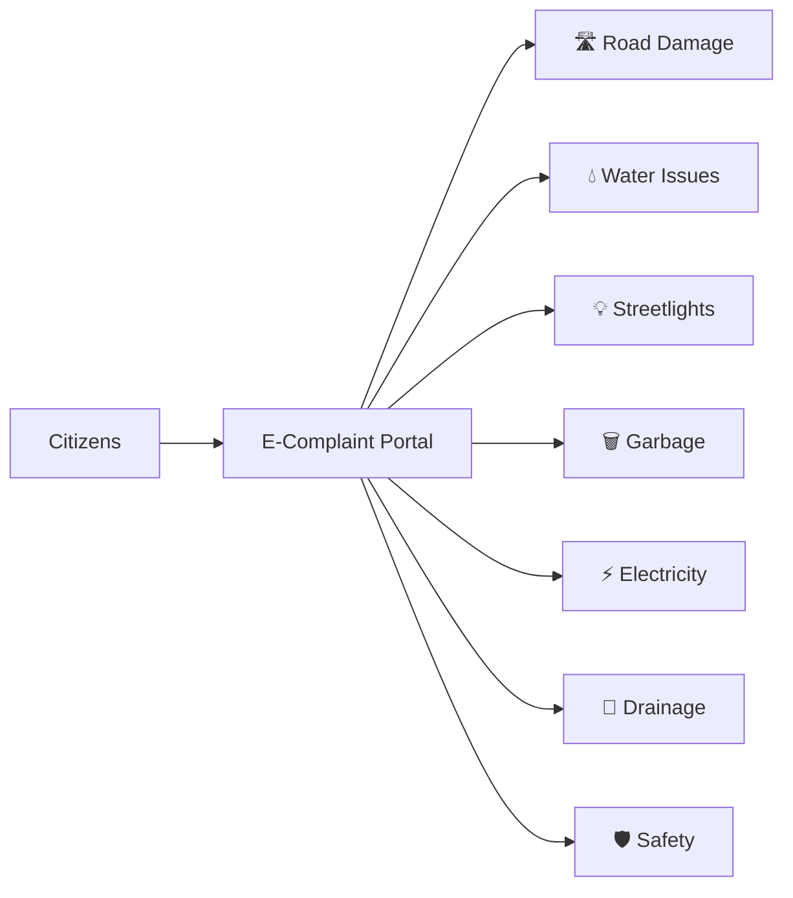
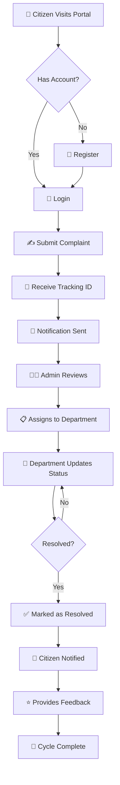
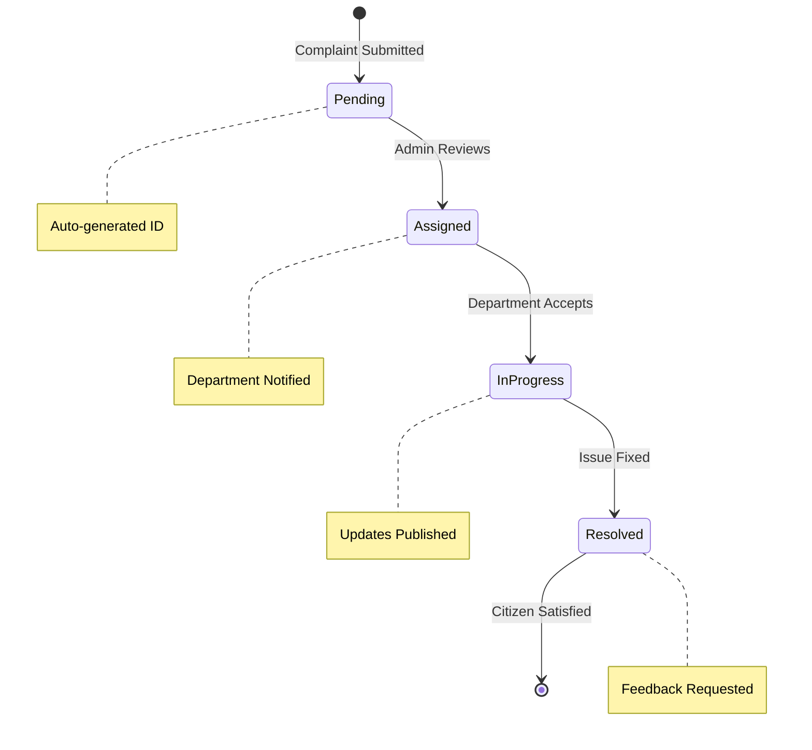

<div align="center">

# 🏛️ E-Complaint Portal for Local Issues

### *Empowering Citizens, Transforming Communities*

[](https://github.com/DishaKotian/E-complaint-portal)
[](https://github.com/DishaKotian/E-complaint-portal)
[](https://github.com/DishaKotian/E-complaint-portal)
[](https://github.com/DishaKotian/E-complaint-portal)

**A modern, transparent, and AI-powered web platform that bridges the gap between citizens and municipal authorities.**

[🚀 Quick Start](#-getting-started) • [✨ Features](#-key-features) • [🤖 AI Chatbot](#-ai-chatbot-features) • [📱 Demo](#-demo-credentials) • [🎯 Future Plans](#-future-enhancements)

---

</div>

## 🌟 Why This Portal Stands Out

<table>
<tr>
<td width="33%" align="center">
<h3>🤖 AI-Powered</h3>
<p>Advanced NLP chatbot with 40+ response patterns that understands context, not just keywords</p>
</td>
<td width="33%" align="center">
<h3>🌍 Truly Multilingual</h3>
<p>Complete translation across 17 pages in English, Hindi, and Kannada</p>
</td>
<td width="33%" align="center">
<h3>🎙️ Voice-First</h3>
<p>Hands-free interaction using cutting-edge Web Speech API</p>
</td>
</tr>
<tr>
<td width="33%" align="center">
<h3>📊 Real-Time Analytics</h3>
<p>Live dashboards with beautiful visualizations powered by Chart.js</p>
</td>
<td width="33%" align="center">
<h3>⚡ Lightning Fast</h3>
<p>Pure vanilla JavaScript - no bloated frameworks, just performance</p>
</td>
<td width="33%" align="center">
<h3>🎨 Beautiful Design</h3>
<p>Modern UI with smooth animations, dark mode, and responsive layouts</p>
</td>
</tr>
</table>

---

## 🎯 Project Overview

> **The Problem:** Citizens struggle to report local civic issues and have no visibility into resolution progress. 
>
> **Our Solution:** A transparent, efficient, and intelligent platform that connects citizens directly with municipal authorities. 

### 🏙️ Issues We Tackle



- 🛣️ **Road damage and potholes**
- 💧 **Water leaks and supply issues**
- 💡 **Non-functional streetlights**
- 🗑️ **Garbage collection problems**
- ⚡ **Electricity issues**
- 🚰 **Drainage and sewage problems**
- 🛡️ **Safety concerns**

---

## ✨ Key Features

<details open>
<summary><b>👥 For Citizens (The People's Voice)</b></summary>

<br>

| Feature | Description | Status |
|---------|-------------|--------|
| 📝 **Simple Submission** | Submit complaints with photo upload in under 2 minutes | ✅ Ready |
| 🎫 **Unique Tracking ID** | Auto-generated format:  `CPL-YYYYMMDD-XXXX` | ✅ Ready |
| 🔄 **Real-Time Tracking** | Live status updates from submission to resolution | ✅ Ready |
| 📚 **Complaint History** | View all your past complaints in one place | ✅ Ready |
| ⭐ **Feedback System** | Rate resolutions from 1-5 stars | ✅ Ready |
| 🤖 **AI Chatbot** | NLP-powered assistant that answers ANY question | ✅ Ready |
| 🎙️ **Voice Input** | Speak in English, Hindi, or Kannada | ✅ Ready |
| 🌍 **Multi-Language** | Complete interface in 3 languages | ✅ Ready |
| 💡 **Smart Suggestions** | Auto-complete with intelligent recommendations | ✅ Ready |
| 💾 **Export Chat** | Download conversation history as . txt | ✅ Ready |

</details>

<details>
<summary><b>👨‍💼 For Administrators (The Decision Makers)</b></summary>

<br>

```ascii
┌─────────────────────────────────────────┐
│  ADMIN DASHBOARD - COMMAND CENTER       │
├─────────────────────────────────────────┤
│                                         │
│  📊 Real-Time Analytics                 │
│  🔍 Advanced Filtering & Search         │
│  📝 Smart Department Assignment         │
│  📈 Automated Reports & Statistics      │
│  👥 Complete User Management            │
│  🎯 Priority Tagging System             │
│  📉 Performance Metrics & Trends        │
│  🗂️ Category-wise Distribution         │
│  📅 Custom Date Range Filtering         │
│  🔄 Bulk Operations Support             │
│                                         │
└─────────────────────────────────────────┘
```

</details>

<details>
<summary><b>🔧 For Department Officers (The Problem Solvers)</b></summary>

<br>

- 📋 **Personalized Dashboard** - View only your assigned complaints
- 🔄 **Progress Updates** - Update status in real-time
- 📝 **Resolution Notes** - Add detailed notes and updates
- ✅ **Mark as Resolved** - Close complaints with confidence
- 📊 **Department Analytics** - Track your team's performance
- 🎯 **Priority Sorting** - Focus on what matters most

</details>

---

## 🤖 AI Chatbot Features

> **Not just another chatbot** - Our NLP engine understands context, learns patterns, and provides intelligent responses. 

### 🧠 Advanced NLP Capabilities

<table>
<tr>
<td width="50%">

**🔍 Keyword Extraction**
- Removes 100+ stop words
- Identifies meaningful terms
- Context-aware filtering

**📊 Similarity Scoring**
- Jaccard index algorithm
- Pattern matching
- Confidence scoring

</td>
<td width="50%">

**❓ Question Type Detection**
- What/How/Why/When
- Where/Who/Which/Can
- Context classification

**🎯 Pattern Matching**
- Regex-based intelligence
- 40+ response patterns
- Continuous learning

</td>
</tr>
</table>

### 📚 Knowledge Base Coverage

```typescript
const chatbotCapabilities = {
  portalQueries: ["submit", "track", "categories", "timelines", "contact"],
  generalConversation: ["greetings", "thanks", "help", "identity"],
  factsAndInfo: ["time", "date", "weather*"], // *coming soon
  mathOperations: ["+", "-", "×", "÷"],
  definitions: ["AI", "blockchain", "cloud", "internet", "programming"],
  funResponses: ["jokes", "compliments", "personality"],
  totalPatterns: 40+
};
```

### 🎨 Chatbot UI/UX Excellence

| Feature | Implementation | Impact |
|---------|----------------|---------|
| 🎨 **Modern Design** | 400x600px floating window | Immersive experience |
| 🎙️ **Voice Input** | Web Speech API (3 languages) | Accessibility boost |
| 💬 **Smart Suggestions** | Debounced autocomplete (300ms) | Faster interactions |
| 📥 **Export Chat** | Download as .txt | Data ownership |
| 🔄 **Chat History** | Last 50 messages stored | Continuity |
| ⚡ **Quick Actions** | 4 pre-configured cards | One-click solutions |
| 🌙 **Dark Mode** | Automatic theme adaptation | Eye comfort |
| 📱 **Responsive** | Works on all devices | Universal access |

---

## 🌍 Multi-Language Support

<div align="center">

### Breaking Language Barriers

| Language | Native Name | Coverage | Voice Support |
|----------|-------------|----------|---------------|
| 🇬🇧 English | English | 100% (17/17 pages) | ✅ Enabled |
| 🇮🇳 Hindi | हिंदी | 100% (17/17 pages) | ✅ Enabled |
| 🇮🇳 Kannada | ಕನ್ನಡ | 100% (17/17 pages) | ✅ Enabled |

**Key Features:**
✨ Dynamic switching (no reload) • 💾 Persistent preference • 🎙️ Voice recognition • 🤖 Chatbot integration

</div>

---

## 🚀 Getting Started

### ⚡ Quick Setup (3 Steps)

```bash
# 1️⃣ Install Dependencies
npm install

# 2️⃣ Start the Server
npm start

# 3️⃣ Open in Browser
# Navigate to: http://localhost:3000
```

### 📋 Prerequisites

```json
{
  "runtime": "Node.js v14+",
  "packageManager": "npm or yarn",
  "browser": "Chrome/Firefox/Safari/Edge (modern)",
  "optional": "Microphone (for voice input)"
}
```

---

## 📁 Project Architecture

<details>
<summary><b>🗂️ Click to expand full structure</b></summary>

```
MiniProj/
│
├── 🌐 public/                         # Frontend (17 HTML pages)
│   ├── 🏠 index.html                  # Homepage with hero section
│   ├── ℹ️ about.html                  # Mission & vision
│   ├── ✍️ submit-complaint.html       # Smart complaint form
│   ├── 🔍 track-complaint.html        # Real-time tracking
│   ├── 📊 public-dashboard.html       # Public statistics
│   ├── 📞 contact. html                # Get in touch
│   ├── ❓ help-faq.html               # Help center
│   ├── 📜 terms. html                  # Legal stuff
│   ├── 🔐 login.html                  # Citizen login
│   ├── 📝 register.html               # New user signup
│   ├── 🔑 forgot-password.html        # Password recovery
│   ├── 👨‍💼 admin-login.html            # Admin portal
│   ├── 📈 admin-dashboard.html        # Command center
│   ├── 🔧 department-login.html       # Department access
│   └── 🛠️ department-dashboard.html   # Officer workspace
│
├── 🎨 public/css/                     # Styling (7,700+ lines)
│   ├── style.css                     # Main stylesheet
│   ├── dashboard.css                 # Dashboard theme
│   ├── chatbot.css                   # Chatbot UI (600+ lines)
│   └── dark-mode.css                 # Dark theme
│
├── ⚡ public/js/                      # Frontend Logic
│   ├── main.js                       # Core utilities
│   ├── complaint-form.js             # Form validation
│   ├── track-complaint.js            # Tracking system
│   ├── contact.js                    # FAQ accordion
│   ├── auth.js                       # User auth
│   ├── admin-auth.js                 # Admin security
│   ├── admin-dashboard.js            # Admin logic
│   ├── department-auth.js            # Department security
│   ├── department-dashboard.js       # Officer logic
│   ├── chatbot.js                    # AI frontend (563 lines)
│   └── language. js                   # i18n engine
│
├── 🖼️ public/images/                  # Visual assets
│
├── ⚙️ server/
│   └── server.js                     # Express + NLP (548 lines)
│
├── 💾 data/                           # JSON Database
│   ├── complaints.json               # All complaints
│   ├── users.json                    # User accounts
│   ├── departments.json              # Officers
│   └── admins.json                   # Admin creds
│
├── 📦 package.json                    # Dependencies
└── 📖 README.md                       # You are here! 

───────────────────────────────────────────────────
📊 Statistics: 35+ files | 10,000+ lines of code
───────────────────────────────────────────────────
```

</details>

---

## 🔐 Demo Credentials

<div align="center">

### 🎭 Try Different Roles

<table>
<tr>
<td align="center" width="33%">

**👨‍💼 Admin Access**

```
📧 admin@gmail.com
🔑 admin1234
```

<sub>Full system control</sub>

</td>
<td align="center" width="33%">

**🔧 Department Officer**

```
📧 roads@example.com
🔑 roads123
```

<sub>Roads Department</sub>

</td>
<td align="center" width="33%">

**👤 Citizen User**

```
📧 demo@example.com
🔑 demo123
```

<sub>Regular user access</sub>

</td>
</tr>
</table>

> ⚠️ **Security Alert:** Change these credentials before production deployment! 

</div>

---

## 💻 Technology Stack

<div align="center">

### 🛠️ Built With Modern Tech

</div>

<table>
<tr>
<td width="50%" valign="top">

### 🎨 Frontend Arsenal

```yaml
Core:
  - HTML5: Semantic, accessible markup
  - CSS3: Flexbox, Grid, animations
  - JavaScript: ES6+, async/await, Fetch API

APIs:
  - Web Speech API:  Voice recognition
  - LocalStorage API: Persistent data
  - Geolocation:  Location tracking

Libraries:
  - Font Awesome 6: 2000+ icons
  - Chart.js: Data visualization
  - Google Fonts:  Poppins, Inter
```

</td>
<td width="50%" valign="top">

### ⚙️ Backend Power

```yaml
Runtime:
  - Node.js v14+:  Server environment
  
Framework:
  - Express.js: RESTful API
  - Body-parser: Request handling
  - CORS: Cross-origin support
  - Multer: File uploads

Database:
  - JSON Files: complaints, users
  - Base64: Image encoding

Intelligence:
  - Custom NLP: Keyword extraction
  - Pattern Matching: Regex-based
  - Similarity Scoring: Jaccard index
```

</td>
</tr>
</table>

---

## 🎨 Design Philosophy

<div align="center">

### Colors That Inspire Trust

```
┌─────────────────────────────────────────────┐
│  🔵 Primary:   #2563eb  (Professional Blue) │
│  ⚪ Secondary:  #ffffff  (Clean White)       │
│  🔘 Accent:    #f3f4f6  (Soft Gray)         │
│  🟢 Success:   #10b981  (Trust Green)       │
│  🔴 Urgent:    #ef4444  (Alert Red)         │
│  🟡 Warning:   #f59e0b  (Caution Yellow)    │
└─────────────────────────────────────────────┘
```

**Typography:** Segoe UI • Clean & Professional  
**Philosophy:** Minimal, Accessible, Trustworthy

</div>

---

## 📱 Responsive Design

<div align="center">

### Works Everywhere, Beautifully

| Device | Breakpoint | Optimizations |
|--------|------------|---------------|
| 📱 **Mobile** | 320px+ | Touch-friendly, stacked layout |
| 📲 **Tablet** | 768px+ | Grid layouts, better spacing |
| 💻 **Desktop** | 1024px+ | Multi-column, sidebar navigation |
| 🖥️ **Large Screen** | 1440px+ | Max-width containers, wider cards |

**Result:** Seamless experience across 4 device categories

</div>

---

## 🔄 User Journey

<div align="center">



</div>

---

## 📊 Features in Detail

### 🗂️ Complaint Categories

<div align="center">

| Icon | Category | Priority Handling |
|------|----------|-------------------|
| 🛣️ | Road Damage / Potholes | High/Medium/Low |
| 💧 | Water Leak / Supply Issue | High/Medium/Low |
| 💡 | Streetlight Not Working | High/Medium/Low |
| 🗑️ | Garbage Collection Issue | High/Medium/Low |
| ⚡ | Electricity / Power Issue | High/Medium/Low |
| 🚰 | Drainage / Sewage Problem | High/Medium/Low |
| 🛡️ | Safety / Security Concern | High/Medium/Low |
| 📦 | Other | High/Medium/Low |

</div>

### 🔄 Status Workflow



### 🎯 Priority System

<table>
<tr>
<td align="center" width="33%">

**🔴 HIGH**

Emergency issues  
Response:  < 24hrs  
Examples: Safety, Water

</td>
<td align="center" width="33%">

**🟡 MEDIUM**

Important issues  
Response: 2-3 days  
Examples: Roads, Lights

</td>
<td align="center" width="33%">

**🟢 LOW**

Routine issues  
Response: 5-7 days  
Examples:  Aesthetics

</td>
</tr>
</table>

---

## 🔌 API Documentation

### 📡 RESTful Endpoints

<details>
<summary><b>🗂️ Complaint Management API</b></summary>

```javascript
// Get all complaints
GET /api/complaints
Response: Array<Complaint>

// Get specific complaint
GET /api/complaints/:id
Response: Complaint

// Create new complaint
POST /api/complaints
Body: { category, description, location, image, priority }
Response: { id, message }

// Update complaint status
PUT /api/complaints/:id
Body: { status, notes, departmentId }
Response: { success, message }

// Submit feedback
POST /api/complaints/:id/feedback
Body: { rating, comment }
Response: { success }

// Get statistics
GET /api/complaints/stats
Response: { total, byStatus, byCategory, avgResolutionTime }
```

</details>

<details>
<summary><b>🤖 AI Chatbot API</b></summary>

```javascript
// Chat with NLP engine
POST /api/chatbot
Body: {
  message:  string,
  history: Array<Message>
}
Response: {
  response: string,
  understood: boolean,
  questionType: string,
  keywords: Array<string>,
  confidence: number
}
```

</details>

<details>
<summary><b>🔐 Authentication API</b></summary>

```javascript
// User registration
POST /api/auth/register
Body: { name, email, password, phone }
Response: { success, userId, token }

// User login
POST /api/auth/login
Body: { email, password }
Response: { success, user, token }

// Admin login
POST /api/auth/admin-login
Body: { email, password }
Response: { success, admin, token }

// Department login
POST /api/auth/department-login
Body: { email, password }
Response: { success, officer, token }
```

</details>

---

## 🚀 Development Guide

### 🛠️ Development Mode

```bash
# Install dependencies
npm install

# Run with auto-reload
npm run dev

# Run tests (if configured)
npm test

# Build for production
npm run build
```

### 🧪 Testing Locally

```bash
# 1. Start server
npm start

# 2. Test endpoints
curl http://localhost:3000/api/complaints

# 3. Open browser
open http://localhost:3000
```

---

## 🚀 Deployment Guide

<div align="center">

### Choose Your Platform

</div>

<table>
<tr>
<td width="25%" align="center">

**▲ Vercel**

⭐ Recommended

```bash
npm i -g vercel
vercel
```

Free • Fast • Easy

</td>
<td width="25%" align="center">

**🟣 Heroku**

Classic Choice

```bash
git push heroku main
```

$7/mo • Reliable

</td>
<td width="25%" align="center">

**🔷 Render**

Modern Platform

```
Auto-deploy
from GitHub
```

Free tier available

</td>
<td width="25%" align="center">

**🚂 Railway**

Developer Friendly

```
Import from
GitHub
```

Free $5 credit

</td>
</tr>
</table>

### ✅ Pre-Deployment Checklist

```markdown
- [ ] Change default admin credentials
- [ ] Enable HTTPS/SSL certificates
- [ ] Configure CORS for production domains
- [ ] Add rate limiting middleware
- [ ] Set up environment variables (. env)
- [ ] Test all features on staging
- [ ] Configure error logging (e.g., Sentry)
- [ ] Set up automated backups
- [ ] Update API base URLs
- [ ] Test voice input on HTTPS
```

---

## 🎯 Future Enhancements

<div align="center">

### 🗺️ Roadmap to Excellence

</div>

<table>
<tr>
<td width="50%" valign="top">

### 🔜 Phase 1 (Next 3 months)

- [ ] 📱 **SMS/Email Notifications**  
  Twilio + SendGrid integration

- [ ] 🗺️ **GPS Location Mapping**  
  Google Maps API for pinpoint accuracy

- [ ] 🔐 **OTP Verification**  
  Secure 2FA authentication

- [ ] 📊 **Advanced Analytics**  
  Elasticsearch for deep insights

- [ ] 📄 **PDF/Excel Reports**  
  jsPDF + ExcelJS export

</td>
<td width="50%" valign="top">

### 🚀 Phase 2 (6-12 months)

- [ ] 📱 **Mobile Apps**  
  React Native or Flutter

- [ ] 🧠 **ML-Powered Chatbot**  
  TensorFlow.js integration

- [ ] 💾 **Database Migration**  
  MongoDB or PostgreSQL

- [ ] ⚡ **Redis Caching**  
  10x performance boost

- [ ] 🔔 **WebSocket Notifications**  
  Real-time push updates

</td>
</tr>
<tr>
<td colspan="2" valign="top">

### 🌟 Phase 3 (Future Vision)

- [ ] 🖼️ **Image Recognition** - Auto-categorize complaints using computer vision
- [ ] 💬 **Citizen Forum** - Community discussions and peer support
- [ ] 🏆 **Gamification** - Badges, leaderboards, and rewards
- [ ] 🔗 **Government API Integration** - Connect with official systems
- [ ] 🌐 **Blockchain Verification** - Immutable complaint records
- [ ] 📈 **Predictive Analytics** - Forecast issues before they occur

</td>
</tr>
</table>

---

## 👥 Meet the Team

<div align="center">

### 🎤 Team VoiceUp

<table>
<tr>
<td align="center" width="50%">

### Disha J Kotian

**Full Stack Developer**

🔧 Backend Architect  
🎨 UI/UX Designer  
🤖 NLP Engineer

[](https://github.com/DishaKotian)

</td>
<td align="center" width="50%">

### Chaithali R Shettigar

**Full Stack Developer**

⚡ Frontend Specialist  
📊 Data Analyst  
🌍 i18n Expert

[](https://github.com)

</td>
</tr>
</table>

**Institution:** Srinivas University  
**Project Duration:** [Duration]  
**Contact:** [Email/Social Links]

</div>

---

## 🏆 Project Achievements

<div align="center">

### By the Numbers

```
┌─────────────────────────────────────────────────┐
│  📊 PROJECT STATISTICS                          │
├─────────────────────────────────────────────────┤
│                                                 │
│  📄 Total Lines of Code ........ ....  10,000+    │
│  📱 HTML Pages ....................  17          │
│  ⚡ JavaScript Files .............. 10+         │
│  🎨 CSS Files (Total Lines) ....... 4 (7,700+) │
│  🔌 API Endpoints .................  10+         │
│  🤖 Chatbot Response Patterns . .... 40+         │
│  🌍 Languages Supported ........... 3           │
│  👥 User Roles ................ .... 3           │
│  📊 Status:  ✅ Production Ready                │
│                                                 │
└─────────────────────────────────────────────────┘
```

</div>

### 🎖️ Key Milestones

- ✅ **Zero Compilation Errors** - Clean, production-ready code
- ✅ **17 Fully Functional Pages** - Complete web application
- ✅ **AI-Powered NLP** - Advanced chatbot with context understanding
- ✅ **Multi-Language Support** - 100% translation coverage
- ✅ **Voice Integration** - Web Speech API in 3 languages
- ✅ **Real-Time Analytics** - Live dashboards with Chart.js
- ✅ **35+ Files** - Well-organized, maintainable codebase
- ✅ **Responsive Design** - Works on all devices

---

## 🎓 Learning Outcomes

<div align="center">

### Skills Demonstrated

</div>

<table>
<tr>
<td width="50%" valign="top">

**💻 Technical Skills**

- ✅ Full-stack web development
- ✅ RESTful API design
- ✅ Natural Language Processing
- ✅ User authentication & authorization
- ✅ Data persistence & management
- ✅ Responsive web design
- ✅ Async JavaScript & Promises
- ✅ File upload handling (Base64)

</td>
<td width="50%" valign="top">

**🎨 Advanced Concepts**

- ✅ Internationalization (i18n)
- ✅ Web Speech API integration
- ✅ State management (localStorage)
- ✅ Data visualization (Chart.js)
- ✅ UI/UX best practices
- ✅ Accessibility (a11y)
- ✅ Performance optimization
- ✅ Security best practices

</td>
</tr>
</table>

---

## 🌟 What Makes Us Unique

<div align="center">

### 10 Reasons to Choose This Portal

</div>

| # | Feature | Why It Matters |
|---|---------|----------------|
| 1️⃣ | **🤖 AI-Powered Assistance** | Chatbot understands ANY question, not just portal queries |
| 2️⃣ | **🌍 True Multi-Language** | Complete translation across all 17 pages |
| 3️⃣ | **🎙️ Voice Interaction** | Hands-free submission in 3 languages |
| 4️⃣ | **📊 Real-Time Analytics** | Live dashboards with visual charts |
| 5️⃣ | **🎨 Modern UI/UX** | Floating chatbot, smooth animations, dark mode |
| 6️⃣ | **📱 Fully Responsive** | Seamless experience on all devices |
| 7️⃣ | **🔐 Role-Based Access** | Separate interfaces for 3 user types |
| 8️⃣ | **💾 Persistent Data** | Chat history, tracking, sessions |
| 9️⃣ | **⚡ Fast & Lightweight** | Vanilla JS, no heavy frameworks |
| 🔟 | **🔄 Real-Time Updates** | Live status tracking and notifications |

---

## 📄 License

<div align="center">

This project is developed as part of an **educational initiative** at Srinivas University. 

```
┌─────────────────────────────────────────────┐
│  📝 Educational Use Only                    │
│  🎓 Academic Project                        │
│  ⚠️  Not for Commercial Distribution       │
└─────────────────────────────────────────────┘
```

</div>

---

## 🙏 Acknowledgments

<div align="center">

### Special Thanks To

**🏫 Srinivas University** - For providing the platform and resources  
**👨‍🏫 Our Mentors** - For guidance and support  
**💻 Open Source Community** - For amazing tools and libraries  
**🌟 Contributors** - For feedback and testing

</div>

---

<div align="center">

## 💬 Get in Touch

Have questions?  Want to contribute? Found a bug? 

[](mailto:your-email@example.com)
[](https://github.com/DishaKotian/E-complaint-portal/issues)
[](https://github.com/DishaKotian/E-complaint-portal)

---

### 🌟 Star this repo if you found it helpful!

**Designed to improve transparency, accountability, and community well-being.**

*Made with ❤️ by Team VoiceUp | Srinivas University*

---

**📝 Documentation Version:** 2.0  
**🗓️ Last Updated:** January 4, 2026  
**✅ Status:** Production Ready

---

<sub>© 2026 Team VoiceUp. All Rights Reserved.</sub>

</div>
